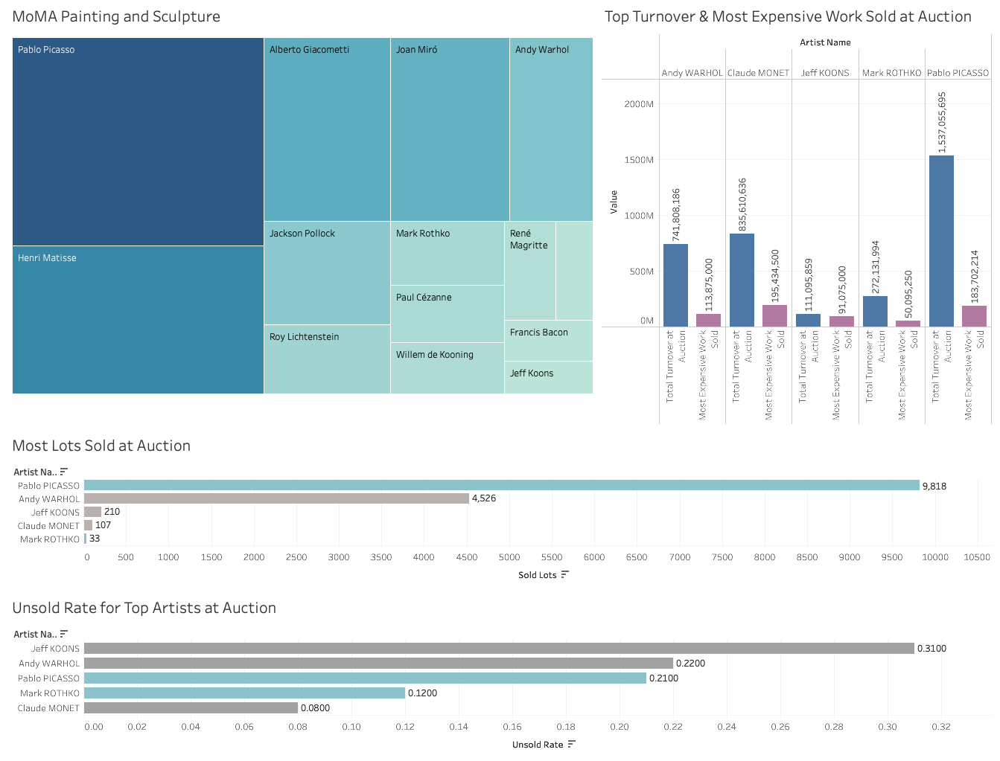

# Business Fundamentals MVP

I have scraped and compiled 4 datasets: two pertaining to MoMA's artworks and artists and the other two to the most expensive works sold at auction and total artist turnover at auction for 2017-19. After doing some cleaning and filtering in Python, I uploaded my datasets to Google Sheets. I created some new columns as well as some pivot tables that filtered and aggregated data in ways that could be helpful for analysis and visualization purposes.  

I cross evaluated MoMA's painting and sculpture holdings with top performing artists and their corresponding works, using artists with the most auction turnover as a measure of "popularity." Looking at artists that MoMA has the most works of and their corresponding auction statistics, two artists were of note: Pablo Picasso and Mark Rothko. While Picasso's works have sold for a total of 1.5 billion, the market seems oversaturated with his work -- a disproportionate amount of his work is put up for sale and holds a relatively higher unsold rate. In comparison, though Rothko's most expensive work is a mere 1/3 of Picasso's, his work has a significantly less unsold rate and the rarity of his work to pop up in the market might make it more covetable. 

